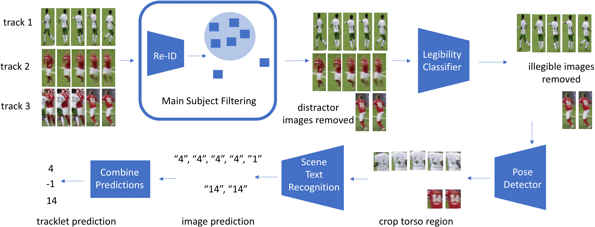

# A General Framework for Jersey Number Recognition in Sports
Code, data, and model weights for paper  [A General Framework for Jersey Number Recognition in Sports](https://openaccess.thecvf.com/content/CVPR2024W/CVsports/papers/Koshkina_A_General_Framework_for_Jersey_Number_Recognition_in_Sports_Video_CVPRW_2024_paper.pdf) (Maria Koshkina, James H. Elder).



Image-level detection, localization and recognition (experiments on Hockey dataset):
  - legibility classifier
  - scene text recognition for jersey numbers

Tracklet-level detection, localization and recognition (experiments on SoccerNet dataset):
  - occlusion/outlier removal using re-id features and fitting a Gaussian
  - legibility classifier
  - pose-guided RoI cropping
  - scene text recognition for jersey numbers
  - tracklet prediction consolidation

## Requirements:
* pytorch 1.9.0
* opencv

## Setup:
Clone current repo.
Create conda environment and install requirements.
Code makes use of the several repositories. Run 
```
python3 setup.py 
```

to automatically clone, setup a separate conda environment for each and fetch models. 

Alternatively,  clone each of the following repo, setup conda environments for each following documentation in corresponding repo, and download models:
### SAM:
Should be in jersey-number-pipeline/sam. Repo: [https://github.com/davda54/sam](https://github.com/davda54/sam)

### Centroid-Reid:
Should be in jersey-number-pipeline/reid/centroids-reid. Repo: [https://github.com/mikwieczorek/centroids-reid](https://github.com/mikwieczorek/centroids-reid).
Download [centroid-reid model weights](https://drive.google.com/file/d/1bSUNpvMfJkvCFOu-TK-o7iGY1p-9BxmO/view?usp=sharing) and place 
them under jersey-number-pipeline/reid/centroids-reid/models.

### ViTPose:
Should be in jersey-number-pipeline/pose/ViTPose. Repo: [https://github.com/ViTAE-Transformer/ViTPose](https://github.com/ViTAE-Transformer/ViTPose).
Download [ViTPose model weights](https://1drv.ms/u/s!AimBgYV7JjTlgShLMI-kkmvNfF_h?e=dEhGHe) and place 
them under jersey-number-pipeline/pose/ViTPose/checkpoints/.

### PARSeq:
We include the version of the PARSeq code that was used to fine-tune the jersey number model as part of this repo. The original PARSeq repo is [https://github.com/baudm/parseq](https://github.com/baudm/parseq). Model weights should be downloaded and placed under jersey-number-pipeline/models/. 
* [Original model weights](https://drive.google.com/file/d/1AK_GnM6pIYyfIf3tBYSKIyR3Fa3Z46Cx/view?usp=sharing)
* [Hockey fine-tuned](https://drive.google.com/file/d/1FyM31xvSXFRusN0sZH0EWXoHwDfB9WIE/view?usp=sharing)
* [SoccerNet fine-tuned](https://drive.google.com/file/d/1uRln22tlhneVt3P6MePmVxBWSLMsL3bm/view?usp=sharing)


## Data:
SoccerNet Jersey Number Recognition:
[https://github.com/SoccerNet/sn-jersey](https://github.com/SoccerNet/sn-jersey)
Download and save under /data subfolder. 

* Weakly-labelled player images used to train legibility classifier can be downloaded [here](https://drive.google.com/file/d/1CmJfUmS_ZudgEiCT14b2CbyMA3nEO_uy/view?usp=sharing). 
* Weakly-labelled jersey number crops used to fine-tune STR in LMDB format can be downloaded [here](https://drive.google.com/file/d/1PX8XDF3nNMZAvcjL6M5hurwX78ePAhSs/view?usp=sharing).

Hockey (comprised of legibility dataset and jersey number dataset): 
* Request access by contacting [Maria Koshkina](mailto:koshkina@hotmail.com?subject=Hockey). Extract under data/Hockey subfolder.

### Trained Legibility Classifier Weights:
Download and place under jersey-number-pipeline/models/.
* [Hockey](https://drive.google.com/file/d/1RfxINtZ_wCNVF8iZsiMYuFOP7KMgqgDp/view?usp=sharing)
* [SoccerNet](https://drive.google.com/file/d/18HAuZbge3z8TSfRiX_FzsnKgiBs-RRNw/view?usp=sharing)


## Configuration:
Update configuration.py if required to set custom path to data or dependencies. 

## Inference:
To run the full inference pipeline for SoccerNet:
```
python3 main.py SoccerNet test
```
To run legibility and jersey number inference for hockey:
```
python3 main.py Hockey test
```
Update actions in main.py actions list to run steps selectively.

## Train (Hockey)
Train legibility classifier:
```
python3 legibility_classifier.py --train --arch resnet34 --sam --data <new-dataset-directory> --trained_model_path ./experiments/hockey_legibility.pth
```

Fine-tune PARSeq STR for hockey number recognition:
```
python3 main.py Hockey train --train_str
```

Trained model will be under str/parseq/outputs

## Train (SoccerNet)
To train legibility classifier and jersey number recognition for SoccerNet, we first generate weakly labelled datasets and then use them to fine-tune.
Weak labels are obtained by using models trained on hockey data.

Train legibility classifier for it:
```
python3 legibility_classifier.py --finetune --arch resnet34 --sam --data <new-dataset-directory>  --full_val_dir
<new-dataset-directory>/val --trained_model_path ./experiments/hockey_legibility.pth --new_trained_model_path ./experiments/sn_legibility.pth
```

Fine-tune PARSeq on weakly-labelled SoccerNet data:
```
python3 main.py SoccerNet train --train_str
```

Trained model will be under str/parseq/outputs.

## Citation
```
@InProceedings{Koshkina_2024_CVPR,
    author    = {Koshkina, Maria and Elder, James H.},
    title     = {A General Framework for Jersey Number Recognition in Sports Video},
    booktitle = {Proceedings of the IEEE/CVF Conference on Computer Vision and Pattern Recognition (CVPR) Workshops},
    month     = {June},
    year      = {2024},
    pages     = {3235-3244}
}
```

## Acknowledgements
We would like to thank authors of the following repositories: 
* [PARSeq](https://github.com/baudm/parseq)
* [Centroid-Reid](https://github.com/mikwieczorek/centroids-reid)
* [ViTPose](https://github.com/ViTAE-Transformer/ViTPose)
* [SoccerNet](https://github.com/SoccerNet/sn-jersey)
* [McGill Hockey Player Tracking Dataset](https://github.com/grant81/hockeyTrackingDataset)
* [SAM](https://github.com/davda54/sam)

## License
[](http://creativecommons.org/licenses/by-nc/3.0/)

This work is licensed under a [Creative Commons Attribution-NonCommercial 3.0 Unported License](http://creativecommons.org/licenses/by-nc/3.0/).
